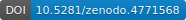
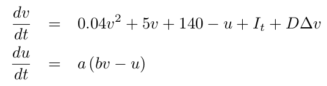
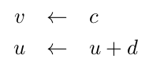

# Izhikevich lattice model in *Python* and *julia*

This repo contains implementations of the Izhikevich model of cellular excitability on a 2D lattice.  
The code is available in Python and Julia.  

**References:**  
Izhikevich, E., Simple model of spiking neurons. __*IEEE Transactions on Neural Networks*__ 14(6):1569-1572, 2003.  
Izhikevich, E., Which model to use for cortical spiking neurons? __*IEEE Transactions on Neural Networks*__ 15(5):1063-1070, 2004.

**Rendered page:** https://frederic-vw.github.io/izhikevich-2d/

**_Python_ Requirements:**
1. [python](https://www.python.org/) installation, latest version tested 3.6.9
2. python packages (`pip install package-name`)
  - NumPy
  - Matplotlib
  - opencv-python (save data as movie)

**_Julia_ Requirements:**
1. [julia](https://julialang.org/) installation, latest version tested 1.6.1
2. julia packages (`julia > using Pkg; Pkg.add("Package Name")`)
  - NPZ
  - PyCall (load Matplotlib animation functionality)
  - PyPlot
  - Statistics
  - VideoIO (save data as movie)

## Izhikevich model

The Izhikevich model uses two variables to model membrane potential dynamics in response to current injections. The variable `v` represents voltage, `u` is a recovery variable, modelling K+ and other currents. The free parameters (`a, b, c, d, v0, vpeak`) can produce a variety of spiking, bursting and other interesting firing patterns.  
Spatial coupling is introduced via diffusion of the voltage-like variable:

When the voltage threshold is exceeded, $v \ge v_{peak}$, the following reset/update is performed:

<!--
Noise is added via Itô-integration:

-->

The main function call running the simulation is: `izh2d(N, T, t0, dt, s, D, a, b, c, d, v0, vpeak, I, stim, blocks)`:  
- `N`: lattice size `(N,N)`
- `T`: number of simulation time steps
- `t0`: number of 'warm-up' iterations
- `dt`: integration time step
- `s`: noise intensity (&sigma;)
- `D`: diffusion constant
- `a,b,c,d,vpeak`: Izhikevich model parameters, `I`: stimulation current amplitude
- `v0`: initial membrane voltage
- `stim`: stimulation current parameters, array of time-, x-, and y-interval borders
- `blocks`: conduction blocks, array of x- and y-interval borders

**Outputs:** `(T,N,N)` array as NumPy .npy format and as .mp4 movie.

In example 1, use
- `stim = [ [[1,550], [1,5], [1,10]], [[2400,2800], [45,50], [1,30]] ]`
- `blocks = [ [[1,20], [10,15]] ]`
(Julia parameters, in Python change 1 to 0)

### Example-1
Stimulation in the lower left corner generates a travelling wave along a narrow channel formed by the left boundary and the conduction block defined by `blocks`, an early after-depolarization within the partially refractory region generates a spiral wave.
Parameters:  
`N = 128, T = 15000, t0 = 500, dt = 0.05, s = 1.0, D = 0.075, a = 0.02, b = 0.2, c = -50, d = 2.0, v0 = -70, vpeak = 30, I = 15`

<video src="videos/izh2d_I_15.0_s_1.00_D_0.075.webm" width="256" height="256" controls preload></video>

### Conclusions
The Izhikevich lattice model using bursting neurons can produce spiral waves and other travelling waves.
